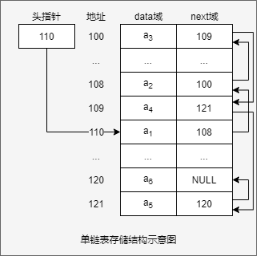
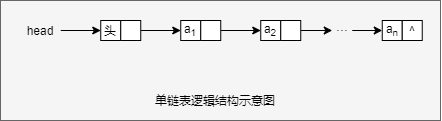

# 链表 （Linked List）

## 单链表介绍

- 存储结构

  链表是有序的列表，但是它再内存中的存储时无序的，如下图所示：

  

  - 链表是以节点的方式来存储
  - 每个节点包含data域，next域（指向下一个节点的地址）。
  - 如图：链表的各个节点**不一定是连续存储**
  - 链表分带头节点的链表和没有头节点的链表。根据实际需求来确定。

- 逻辑结构

  

---

## 单链表创建和遍历的分析实现

### 分析

应用示例：使用带head头节点的**单线链表**实现Pokemon的管理

1. 完成对Pokemon的**增删改查**操作。

2. ~~第一种增方法，直接添加到链表尾部，不考虑No顺序。~~

3. 第二种方式在添加Pokemon时，根据No序号将Pokemon插入到指定位置（如果有这个No序号，则添加失败，并给出提示）

   **思路**：

   - 首先找到新添加的节点的位置。（通过辅助变量遍历找到）
   - 新节点.next = temp.next;
   - temp.next = 新节点;

4. 完成对链表节点的修改

   **思路**:

   - 根据编号No修改节点信息(name),不能修改编号No,修改编号相当于新添加节点
   - 如果需要修改的数据量大可以改为将原有节点替换为新节点

5. 从单链表中删除一个节点

   **思路**:

   - 先找到需要删除的这个节点的前一个节点temp
   - temp.next = temp.next.next;
   - 被删除的节点,将不会有其它引用指向,会被gc回收.

### 实现

1. PokemonNode

   ```java
   class PokemonNode {
       public int no;
       public String name;
       public PokemonNode next;//指向下一个节点
   
       //构造器
       public PokemonNode(int no, String name) {
           this.no = no;
           this.name = name;
       }
   
       @Override
       public String toString() {
           return "PokemonNode{" +
                   "no=" + no +
                   ", name='" + name + '\'' +
                   '}';
       }
   }
   ```

2. 定义SingleLinkedList类，用于管理PokemonNode节点

   - 初始化头节点

     ```java
     private PokemonNode head = new PokemonNode(0, "");
     ```

   - 按编号顺序添加节点

     ```java
     public void addOrderByNo(PokemonNode pokemonNode) {
             //因为头节点不能动，因此通过一个辅助变量来找到添加的位置
             //因为是单链表，我们找的temp是位于添加位置的前一个节点。否则插入不了
             PokemonNode temp = head;
             boolean flag = false; //flag标志添加的编号是否存在，默认为false
             while (true) {
                 if (temp.next == null) {
                     temp.next = pokemonNode;
                     return;
                 } else if (temp.next.no > pokemonNode.no) {
                     pokemonNode.next = temp.next;
                     temp.next = pokemonNode;
                     return;
                 } else if (temp.next.no == pokemonNode.no) {
                     System.err.println("No" + pokemonNode.no + "已经存在，添加失败。");
                     return;
                 }
                 temp = temp.next;//后移
             }
         }
     ```

   - 修改节点的信息

     ```java
         //注：这里采用更改原有节点值，如果修改的数据量比较大可以直接替换节点
         public void update(PokemonNode newPokemonNode) {
             //判断链表是否为空
             if (head.next == null) {
                 System.err.println("链表为空");
                 return;
             }
             //修改原有节点值
             PokemonNode temp = head.next;
             while (true){
                 if (temp == null){
                     System.err.printf("未找到No%d，无法修改。\n",newPokemonNode.no);
                     return;
                 }else if (temp.no == newPokemonNode.no){
                     temp.name = newPokemonNode.name;
                     return;
                 }
                 temp = temp.next;
             }
     
             //替换节点的方式
     //        PokemonNode temp = head;
     //        while (temp.next != null) {
     //            if (temp.next.no == newPokemonNode.no) {
     //                newPokemonNode.next = temp.next.next;
     //                temp.next = newPokemonNode;
     //                return;
     //            }
     //            temp = temp.next;
     //        }
     //        System.err.printf("未找到No%d，无法修改。\n", newPokemonNode.no);
         }
     ```

   - 删除节点

     ```java
     //删除节点
         public void del(int no){
             PokemonNode temp = head;
             while (temp.next!=null){
                 if (temp.next.no == no){
                     temp.next = temp.next.next;
                     return;
                 }
                 temp = temp.next;
             }
             System.err.printf("未找到No%d,无法删除。\n", no);
         }
     ```

   - 显示链表[遍历]

     ```java
         public void showList() {
             //判断是否为空
             if (head.next == null) {
                 System.err.println("链表为空");
                 return;
             }
             //创建一个辅助变量来遍历
             PokemonNode temp = head.next;
             while (temp != null) {
                 //输出节点信息
                 System.out.println(temp);
                 //将temp后移
                 temp = temp.next;
             }
         }
     ```

3. 测试数据

   ```java
       public static void main(String[] args) {
           SingleLinkedList list = new SingleLinkedList();
           PokemonNode p1 = new PokemonNode(1, "妙蛙种子");
           PokemonNode p2 = new PokemonNode(2, "妙蛙草1");
           PokemonNode p3 = new PokemonNode(3, "妙蛙花");
           PokemonNode p4 = new PokemonNode(4, "小火龙");
           PokemonNode p5 = new PokemonNode(5, "火恐龙");
           PokemonNode p6 = new PokemonNode(6, "喷火龙");
           PokemonNode p7 = new PokemonNode(7, "杰尼龟");
           PokemonNode p8 = new PokemonNode(8, "卡咪龟");
           PokemonNode p9 = new PokemonNode(9, "水箭龟");
           PokemonNode p10 = new PokemonNode(2, "妙蛙草");
           PokemonNode p11 = new PokemonNode(18, "妙蛙草");
   
   //        list.addIgnoreNo(p1);
   //        list.addIgnoreNo(p2);
   //        list.addIgnoreNo(p3);
   //        list.addIgnoreNo(p4);
   //        list.addIgnoreNo(p5);
   //        list.addIgnoreNo(p6);
   //        list.addIgnoreNo(p7);
   //        list.addIgnoreNo(p8);
   //        list.addIgnoreNo(p9);
   
   
           list.addOrderByNo(p1);
           list.addOrderByNo(p9);
           list.addOrderByNo(p4);
           list.addOrderByNo(p2);
           list.addOrderByNo(p3);
           list.addOrderByNo(p3);
           list.addOrderByNo(p2);
           list.addOrderByNo(p5);
           list.addOrderByNo(p7);
           list.addOrderByNo(p7);
           list.addOrderByNo(p8);
           list.addOrderByNo(p6);
   
           try {
               Thread.sleep(10);
           } catch (InterruptedException e) {
               e.printStackTrace();
           }
   
           list.showList();
   
           list.update(p10);
           list.update(p11);
           try {
               Thread.sleep(10);
           } catch (InterruptedException e) {
               e.printStackTrace();
           }
           System.out.println("**************************");
   
           list.del(1);
           list.del(2);
           list.del(3);
           list.del(4);
           list.del(5);
           list.del(6);
           list.del(7);
           list.del(8);
           list.del(9);
           list.del(99);
   
           list.showList();
   
       }
   ```
   