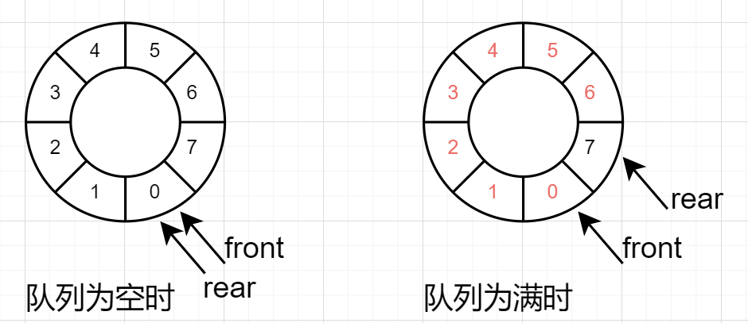

## 队列

### 队列介绍

- 队列是一个有序列表，可以用`数组`或`链表`来实现。
- 遵循`先入先出`的原则。即：现存如队列的数据，要先取出，后存入的要后取出。

### ~~数组模拟队列~~`（不可用）`

- 队列本身是有序列表，若使用数组的结构来存储队列的数据，则设定maxSize为该队列的最大容量。
- 因为队列的输出、输入分别实从队列队首队尾来处理，因此需要两个变量front以及rear分别记录队列前后端的下标，front会随着数据的输出而改变，而rear则是随着数据的输入而改变。
- 代码实现在datastructure.queue.ArraayQueueDemo
- 因为只用普通数组没办法做到复用，并且会出现假溢出的情况
- 将这个数组使用算法，改进成一个环形的队列 （使用取模：% 实现）

### 数组模拟环形队列

- 模型的需求
  1. 判断队列是否为空
  2. 判断队列是否为满
  3. 1、2两点不得冲突
  4. 计算队列的长度

- 环形队列的模型如下图所示（红色字体代表队列在该位置有元素，黑色代表无）：

  1. 我们先假设front指向队列的头部元素。

  2. 再假设rear指向队列尾部元素的前一个位置。

     - 注：此时rear无论指向尾部元素还是尾部元素的前一个位置都无所谓，重要的是当队列为空时与队列为满时，队尾元素不能指向同一个下标(（front固定不动的情况下），所以我们需要空出数组的一个空间用来代表队列为空时的队尾元素。
     - 因为我们假设了rear指向队列尾部的前一个位置，所以我们不妨设数组的最后一个位置为队列为空的队尾元素，此时队列的最大长度为数组长度-1；

     

- 经过模型的分析可以得到

  1. 判断队列为满：(rear + 1) % maxSize = front
  2. 判断队列为空：front = rear
  3. 计算队列长度：(rear + maxSize - front) % maxSize
  4. 数据进队列后rear指向的位置：rear = (rear + 1) % maxSize
  5. 数据出队列后front指向的位置：front = (front + 1) % maxSize

- 代码实现

  1. 初始化用于模拟环形队列的数组

     ```java
         public CircleArray(int arrMaxSize) {
             maxSize = arrMaxSize + 1;//因为队列的实际长度为数组长度-1
             arr = new int[maxSize];
         }
     ```

  2. 判断队列是否满

     ```java
         public boolean isFull() {
             return (rear + 1) % maxSize == front;
         }
     
     ```

  3. 判断队列是否为空

     ```java
         public boolean isEmpty() {
             return front == rear;
         }
     
     ```

  4. 添加数据到队列

     ```java
     public void addQueue(int n) {
             //判断队列是否满
             if (isFull()) {
                 System.err.println("队列已满，不能加入数据。");
                 return;
             }
             //直接将数据加入
             arr[rear] = n;
             //将rear后移，需要考虑取模
             rear = (rear + 1) % maxSize;
         }
     ```

  5. 获取队列的数据（队首出队列）

     ```java
     public int getQueue() {
             //判断队列是否为空
             if (isEmpty()) {
                 throw new RuntimeException("队列为空，不能取数据");
             }
             //1.先把front对应的值保存到一个临时变量
             int tempValue = arr[front];
             //2.front往后移，需考虑取模
             front = (front + 1) % maxSize;
             //3.将临时变量返回
             return tempValue;
         }
     ```

  6. 显示队列的所有数据

     ```java
         public void showQueue() {
             //遍历
             if (isEmpty()) {
                 System.err.println("队列为空。");
                 return;
             }
             for (int i = front; i < front + size(); i++) {
                 System.out.printf("arr[%d]=%d\n", i % maxSize, arr[i % maxSize]);
             }
         }
     
         //求出当前队列有效数据的个数
         public int size() {
             return (rear + maxSize - front) % maxSize;
         }
     ```

  7. 显示队列的头数据，注意不是取出数据

     ```java
         public int headQueue() {
             //判断
             if (isEmpty()) {
                 System.out.println("队列为空");
                 throw new RuntimeException("队列为空，不能取数据");
             }
             return arr[front];
         }
     ```

  8. 测试

     ```java
     public static void main(String[] args) {
             CircleArray arrayQueue = new CircleArray(4);
             char key = ' ';//接收用户输入
             Scanner scanner = new Scanner(System.in);
             boolean loop = true;
             //输出一个菜单
             while (loop) {
                 System.out.println("测试数组模拟环形队列：");
                 System.out.println("s(show):显示队列");
                 System.out.println("e(exit):退出程序");
                 System.out.println("a(add):添加数据到队列");
                 System.out.println("g(get):从队列中取数据");
                 System.out.println("h(head):查看队列头部数据");
                 key = scanner.next().charAt(0);
     
                 switch (key) {
                     case 's':
                         arrayQueue.showQueue();
                         break;
                     case 'a':
                         System.out.print("请输入一个数字：");
                         int value = scanner.nextInt();
                         arrayQueue.addQueue(value);
                         break;
                     case 'g':
                         try {
                             int res = arrayQueue.getQueue();
                             System.out.printf("取出的数据是%d\n", res);
                         } catch (Exception e) {
                             System.err.println(e.getMessage());
                         }
                         break;
                     case 'h':
                         try {
                             int res = arrayQueue.headQueue();
                             System.out.printf("队列头部的数据是%d\n", res);
                         } catch (Exception e) {
                             System.err.println(e.getMessage());
                         }
                         break;
                     case 'e':
                         scanner.close();
                         loop = false;
                         break;
                 }
             }
             System.out.println("程序退出...");
         }
     ```

     


